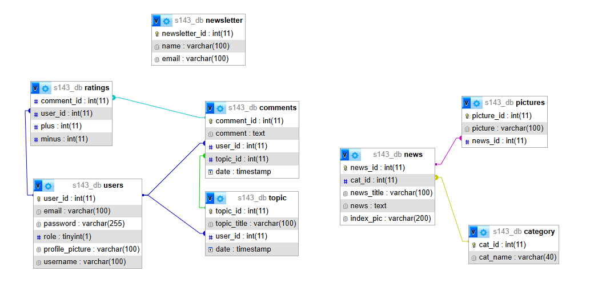

# Vizsgamunka Backend Dokumentáció - DailyWave Hírportál
Készítette: Schilling János Attila, Szabó Balázs

A **DailyWave Hírportál** backendje egy Node.js és Express alapú API, amely felelős a különböző adatkezelésekért, mint például a hírek, fórum témák és hozzászólások kezelése. Az API kapcsolódik egy MySQL adatbázishoz és biztosítja az adatokat a frontend számára.

## Technológiák
- **Node.js** - A backend futtató környezet.
- **Express.js** - Web keretrendszer, amely lehetővé teszi a REST API gyors fejlesztését.
- **MySQL** - Relációs adatbázis a háttéradatok tárolásához.

## Adatbázis
● category
    ○ cat_id
    ○ cat_name

● comments
    ○ comment_id
    ○ comment
    ○ user_id
    ○ topic_id
    ○ date

● news
    ○ news_id
    ○ cat_id
    ○ news_title
    ○ news
    ○ index_pic

● newsletter
    ○ newsletter_id
    ○ name
    ○ email

● pictures
    ○ picture_id
    ○ picture
    ○ news_id

● ratings
    ○ comment_id
    ○ user_id
    ○ plus
    ○ minus

● topic
    ○ topic_id
    ○ topic_title
    ○ user_id
    ○ date

● users
    ○ user_id
    ○ email
    ○ password
    ○ role
    ○ profile_picture
    ○ username

## Telepítés

A backend telepítése a következő lépésekkel történik:

### 1. Klónozd a repót
git clone https://github.com/balazsszabo1/dailywave_backend.git  
cd dailywave-backend  
npm install  
npm run dev

API Endpontok: 
## 📂 AuthControllers.js tartalma

- **`POST /api/auth/register`** – *Új felhasználó regisztrálása*
- **`POST /api/auth/login`** – *Felhasználó bejelentkezése*
- **`POST /api/auth/logout`** – *Felhasználó kijelentkezése*

---

## 👤 ProfileControllers.js tartalma

- **`POST /api/profile/editProfileName`** – *Profil név szerkesztése (JWT token szükséges)*
- **`GET /api/profile/getProfileName`** – *Profil név megjelenítése*
- **`GET /api/profile/editProfilePsw`** – *Profil jelszó megváltoztatása*
- **`POST /api/profile/editProfilePic`** – *Profilkép módosítása*
- **`POST /api/profile/getProfilePic`** – *Profilkép megjelenítése*

---

## 📰 newsControllers.js tartalma

- **`POST /api/news/uploadNews`** – *Hír feltöltése admin felhasználóként*
- **`GET /api/news/getAllNews`** – *Összes hír megjelenítése*
- **`GET /api/news/getNewsById`** – *Hír lekérése ID alapján*
- **`POST /api/news/newsletter`** – *Hírlevélre való feliratkozás*

---

## 💬 topicControllers.js tartalma

- **`POST /api/topic/getAlltopics`** – *Fórum témák lekérése*
- **`POST /api/topic/getComments`** – *Kommentek megjelenítése*
- **`POST /api/topic/addComment`** – *Komment hozzáadása*
- **`POST /api/topic/uploadTopic`** – *Téma feltöltése*

---

## 🔐 Middleware-ek

- **`isAdmin.js`** – *Admin jogosultság ellenőrzése*: csak adminok férnek hozzá bizonyos végpontokhoz.
- **`limiter.js`** – *Rate limiting*: lekérési mennyiség korlátozása IP alapján.
- **`jwtAuth.js`** – *JWT alapú védelem*: védett útvonalakhoz való hozzáférés token alapján (`auth_token` cookie).
- **`multer.js`** – *Fájlfeltöltés konfiguráció (képek)*: `multer` csomaggal képek feltöltése.

---

## 🗃️ Models

- **`db.js`** – *MySQL kapcsolatkezelés*: kapcsolat pool a `mysql2` csomaggal.

---

## 🚦 Routes

- **`adminRoutes.js`** – *Admin jogosultságot igénylő útvonalak* (middleware védett)
- **`authRoutes.js`** – *Felhasználói hitelesítés (regisztráció, belépés, kilépés)*
- **`newsRoutes.js`** – *Hírek API: feltöltés, lekérdezés, hírlevél*
- **`profileRoutes.js`** – *Profilkezelés: név, jelszó, profilkép módosítás/lekérés*
- **`topicRoutes.js`** – *Fórum topikok és kommentek kezelése*

---

## ⚙️ dotenvConfig.js

- *Környezeti változók betöltése a `.env` fájlból a `dotenv` csomag segítségével*

---

## 🧠 Egyéb fájlok

- **`app.js`** – *Express alkalmazás konfigurációja (middleware, route-ok, egyéb beállítások)*
- **`server.js`** – *Szerver indítása: a konfigurált porton elindítja az alkalmazást*

## Backend GitHub és szerver integráció

A projekt backendje a [GitHub repóban található](https://github.com/balazsszabo1/dailywave_backend), ahol a legfrissebb kód mindig elérhető. A backend szerver a következő címen fut: [https://nodejs.dszcbaross.edu.hu/server/7b76faf3](https://nodejs.dszcbaross.edu.hu/server/7b76faf3). 

### Automatikus frissítések:

A backend szerver folyamatosan képes lekérni a legújabb változtatásokat közvetlenül a GitHub repóból, így a legfrissebb verzió mindig elérhető és futtatható anélkül, hogy manuálisan kellene frissíteni a kódot. Ezt a folyamatot automatizált script vagy CI/CD (Continuous Integration/Continuous Deployment) folyamat biztosítja, amely figyeli a GitHub repót, és frissíti a szervert a legújabb kódbázis alapján.

### Használat:

1. **GitHub repo**: Az alkalmazás backend kódja a [https://github.com/balazsszabo1/dailywave_backend](https://github.com/balazsszabo1/dailywave_backend) linken található.
2. **Szerver URL**: A backend szerver elérhetősége: [https://nodejs.dszcbaross.edu.hu/server/7b76faf3](https://nodejs.dszcbaross.edu.hu/server/7b76faf3).

Ez biztosítja, hogy a kód mindig naprakész legyen, és az új változtatások automatikusan tükröződjenek a szerveren.

## Biztonság és Titkosítás

A backend biztosítja az alapvető biztonsági mechanizmusokat az alkalmazás védelme érdekében. A következő megoldások kerültek implementálásra:

### 1. JWT Token-alapú hitelesítés
Az API végpontjai számára biztosított hitelesítés **JSON Web Token (JWT)** alapú. Minden felhasználónak regisztráció után érvényes JWT token-t adunk, amelyet a későbbi API kérésekhez használnak, így biztosítva a hozzáférés védelmét.

### 2. SSL Titkosítás
Az adatbiztonság érdekében a backend API **HTTPS-en** keresztül érhető el, biztosítva, hogy minden adat titkosítva legyen a kliens és a szerver között, ezzel elkerülve az adatlopásokat és lehallgatást.

### 3. Felhasználói adatok védelme
A felhasználók érzékeny adatainak, mint például a jelszavak, titkosítása **bcrypt hash**-el történik, hogy még adatlopás esetén sem legyenek elérhetők az eredeti jelszavak. Az API minden jelszóváltoztatást és regisztrációt biztonságos módon kezel.

---

## Hibakezelés és Naplózás

### 1. Hibakezelés
A backendben a **hibakezelés** központilag van megoldva, hogy minden nem várt esemény a megfelelő válaszformátumban kerüljön továbbításra a frontend felé. A hibák megfelelő kódokkal (pl. 404, 500) vannak jelezve, és az API minden esetben részletes hibaüzenetet biztosít.

### 2. Naplózás
Az alkalmazás **naplózza** a rendszer működését és az API kéréseket. A naplózási információk, mint például az API hívások időpontja, kérés típusai és válaszok, segítenek a hibák gyors diagnosztizálásában és a rendszer általános teljesítményének nyomon követésében. A naplózás konfigurálása az **express-winston** csomag segítségével történik, és a naplóadatok egy központi rendszerbe kerülhetnek továbbításra a későbbi elemzéshez.

## Tesztelés
A backend API tesztelését a **Postman** eszközzel végeztük. A következő teszteket futtattuk le a különböző API végpontokon, hogy biztosítsuk azok helyes működését:

- **Felhasználói regisztráció** (POST `/api/auth/register`)
- **Bejelentkezés** (POST `/api/auth/login`)
- **Profil név szerkesztése** (POST `/api/profile/editProfileName`)
- **Hírek feltöltése** (POST `/api/news/uploadNews`)
- **Komment hozzáadása** (POST `/api/topic/addComment`)
- **Admin jogosultság ellenőrzése** (POST `/api/admin/admin-only`)

A Postman tesztekről készült összes tesztelési link és dokumentáció elérhető [itt](https://link_az_osszes_teszthez).

## 🌐 Frontend

### 🔗 GitHub repo
- [Frontend](https://github.com/your-repo-url)

---

## 🛠️ Használt eszközök

- [Visual Studio Code](https://code.visualstudio.com/)
- [MDN Web Docs](https://developer.mozilla.org/)
- [NPM](https://www.npmjs.com/)
- [Postman](https://www.postman.com/)
- [DrawSQL](https://drawsql.app/)
- [W3Schools](https://www.w3schools.com/)
- [StackOverflow](https://stackoverflow.com/)
- [ChatGPT](https://chat.openai.com/)
- [Tabnine](https://www.tabnine.com/)
- [GitHub](https://github.com/)
- [Google Drive](https://drive.google.com/)

